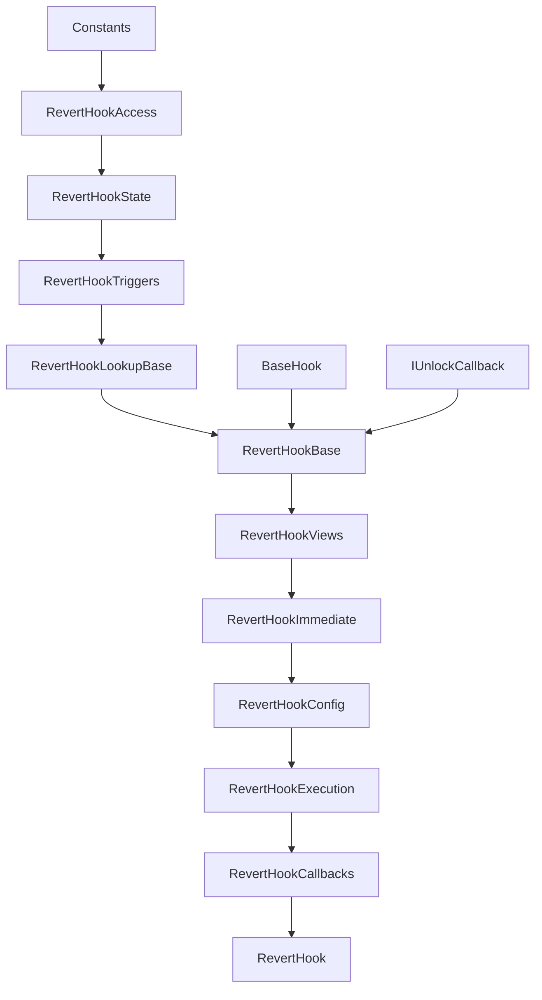
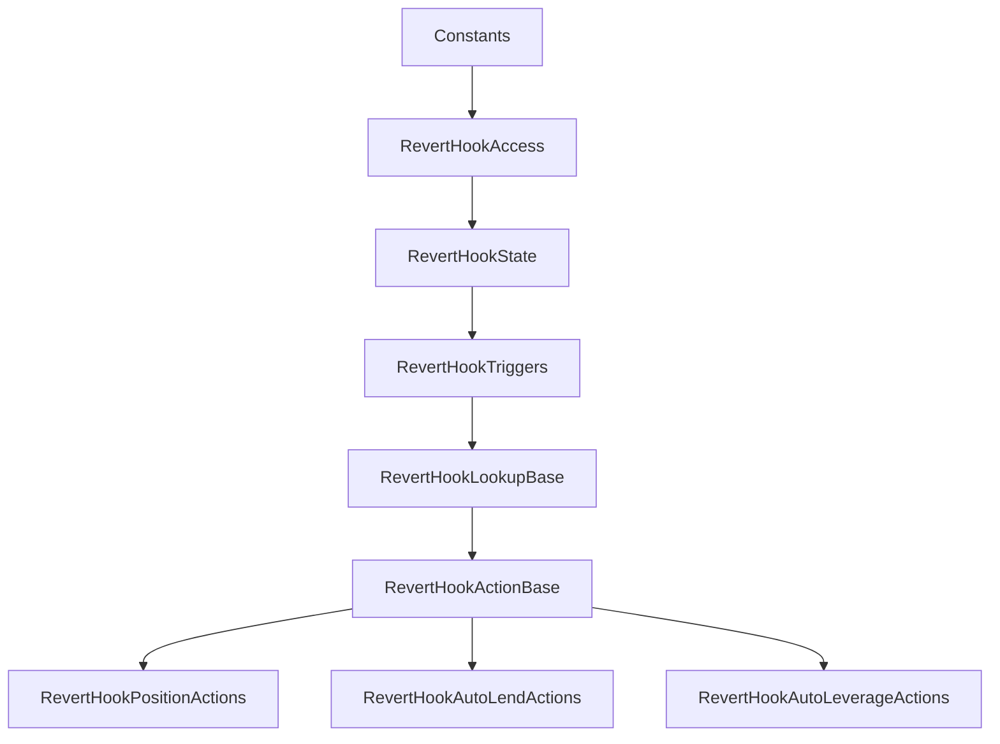

# Hook Hierarchy

This document summarizes the inheritance structure for the `RevertHook` contracts and the delegatecall action targets.

## Main Hook Chain

The deployed hook follows this runtime inheritance path:

```text
Constants
└─ RevertHookAccess
   └─ RevertHookState
      └─ RevertHookTriggers
         └─ RevertHookLookupBase
            └─ RevertHookBase
               ├─ BaseHook
               ├─ IUnlockCallback
               └─ RevertHookViews
                  └─ RevertHookImmediate
                     └─ RevertHookConfig
                        └─ RevertHookExecution
                           └─ RevertHookCallbacks
                              └─ RevertHook
```

Mermaid view:



## Delegatecall Action Targets

The action contracts are not in the deployed hook runtime chain. They branch off from the shared storage and lookup base:

```text
Constants
└─ RevertHookAccess
   └─ RevertHookState
      └─ RevertHookTriggers
         └─ RevertHookLookupBase
            └─ RevertHookActionBase
               ├─ RevertHookPositionActions
               ├─ RevertHookAutoLendActions
               └─ RevertHookAutoLeverageActions
```

Mermaid view:



## Why The Split Exists

`RevertHookLookupBase` is the shared abstraction layer used by both:
- the deployed hook
- the delegatecall action contracts

It exposes virtual reference getters:
- `_positionManagerRef()`
- `_poolManagerRef()`

This lets shared lookup helpers work in both contexts even though:
- `RevertHookBase` gets `poolManager` from `BaseHook`
- `RevertHookActionBase` stores its own immutable `poolManager`

## Storage Layout Constraint

The delegatecall action contracts rely on sharing the same mutable storage layout as the deployed hook for the state spine below:

```text
RevertHookAccess
RevertHookState
RevertHookTriggers
RevertHookLookupBase
```

That means future mutable storage changes must be made carefully:
- safe: add shared mutable storage in the common state chain
- risky: add mutable storage directly in `RevertHookBase`
- risky: add mutable storage directly in `RevertHookActionBase`

Immutables are less dangerous here because they are not part of the contract storage layout used by delegatecall.

## Source Files

- `src/RevertHook.sol`
- `src/hook/RevertHookBase.sol`
- `src/hook/RevertHookViews.sol`
- `src/hook/RevertHookImmediate.sol`
- `src/hook/RevertHookConfig.sol`
- `src/hook/RevertHookExecution.sol`
- `src/hook/RevertHookCallbacks.sol`
- `src/hook/RevertHookLookupBase.sol`
- `src/hook/RevertHookActionBase.sol`
- `src/hook/RevertHookPositionActions.sol`
- `src/hook/RevertHookAutoLendActions.sol`
- `src/hook/RevertHookAutoLeverageActions.sol`
