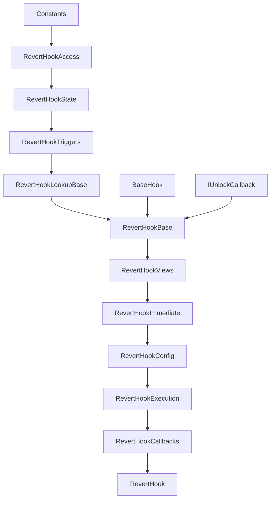
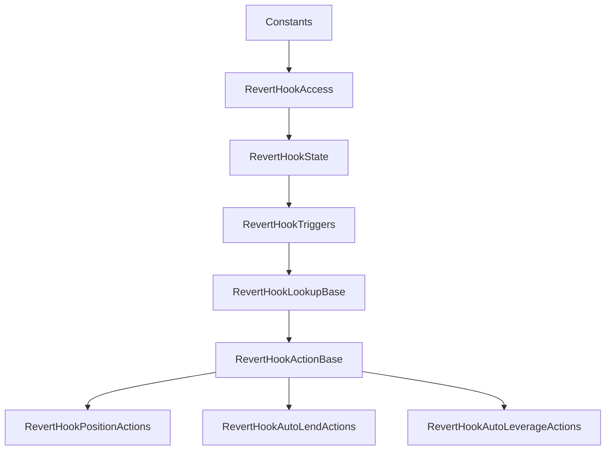

# Hook Hierarchy

This document summarizes the inheritance structure for the `RevertHook` contracts and the delegatecall action targets.

## Main Hook Chain

The deployed hook follows this runtime inheritance path:

```text
Constants
└─ RevertHookAccess
   └─ RevertHookState
      └─ RevertHookTriggers
         └─ RevertHookLookupBase
            └─ RevertHookBase
               ├─ BaseHook
               ├─ IUnlockCallback
               └─ RevertHookViews
                  └─ RevertHookImmediate
                     └─ RevertHookConfig
                        └─ RevertHookExecution
                           └─ RevertHookCallbacks
                              └─ RevertHook
```

Mermaid view:


```mermaid
graph TD
    C["Constants"] --> A["RevertHookAccess"]
    A --> S["RevertHookState"]
    S --> T["RevertHookTriggers"]
    T --> L["RevertHookLookupBase"]

    L --> B["RevertHookBase"]
    BH["BaseHook"] --> B
    IU["IUnlockCallback"] --> B

    B --> V["RevertHookViews"]
    V --> I["RevertHookImmediate"]
    I --> CFG["RevertHookConfig"]
    CFG --> E["RevertHookExecution"]
    E --> CB["RevertHookCallbacks"]
    CB --> H["RevertHook"]
```

## Delegatecall Action Targets

The action contracts are not in the deployed hook runtime chain. They branch off from the shared storage and lookup base:

```text
Constants
└─ RevertHookAccess
   └─ RevertHookState
      └─ RevertHookTriggers
         └─ RevertHookLookupBase
            └─ RevertHookActionBase
               ├─ RevertHookPositionActions
               ├─ RevertHookAutoLendActions
               └─ RevertHookAutoLeverageActions
```

Mermaid view:


```mermaid
graph TD
    C["Constants"] --> A["RevertHookAccess"]
    A --> S["RevertHookState"]
    S --> T["RevertHookTriggers"]
    T --> L["RevertHookLookupBase"]

    L --> AB["RevertHookActionBase"]
    AB --> PA["RevertHookPositionActions"]
    AB --> AL["RevertHookAutoLendActions"]
    AB --> AV["RevertHookAutoLeverageActions"]
```

## Why The Split Exists

`RevertHookLookupBase` is the shared abstraction layer used by both:
- the deployed hook
- the delegatecall action contracts

It exposes virtual reference getters:
- `_positionManagerRef()`
- `_poolManagerRef()`

This lets shared lookup helpers work in both contexts even though:
- `RevertHookBase` gets `poolManager` from `BaseHook`
- `RevertHookActionBase` stores its own immutable `poolManager`

## Storage Layout Constraint

The delegatecall action contracts rely on sharing the same mutable storage layout as the deployed hook for the state spine below:

```text
RevertHookAccess
RevertHookState
RevertHookTriggers
RevertHookLookupBase
```

That means future mutable storage changes must be made carefully:
- safe: add shared mutable storage in the common state chain
- risky: add mutable storage directly in `RevertHookBase`
- risky: add mutable storage directly in `RevertHookActionBase`

Immutables are less dangerous here because they are not part of the contract storage layout used by delegatecall.

## Hook-Owned Controllers

Three standalone controller contracts extend `HookOwnedControllerBase` (immutable `hook` reference; admin calls authorize against the hook's owner). They are constructor-wired immutables of the hook, deployed at nonce-predicted addresses before the CREATE2 hook deployment:

- `HookFeeController` - protocol fee parameters for automation flows.
- `HookRouteController` - protocol-managed swap routes.
- `HookAuctionController` - per-pool arbitrage auctions. Called directly (no try/catch) from `beforeSwap`, `beforeAddLiquidity`, and `beforeRemoveLiquidity`; its hook entrypoints are non-reverting by construction, with the token-dependent donate leg isolated behind an internal try/catch. It is the only caller of the hook's `updateDynamicLPFee` passthrough, so a pool's stored dynamic fee cannot drift from the fee the auction winner is quoted against.

`HookLeaseController` is an alternative implementation of the same hook-facing `IHookAuctionController` interface: a continuous Harberger lease (self-assessed price, per-second rent dripped to LPs, permissionless buyout at price + bump) instead of epoch auctions, with the same safety construction. A deployment wires exactly ONE of the two into the hook's auction-controller constructor slot.

Controllers hold their own storage (the auction and lease controllers custody deposit/bid escrow, refunds, and protocol fees) and are plain external calls, so they cannot affect the delegatecall storage layout below.

## Source Files

- `src/RevertHook.sol`
- `src/hook/RevertHookBase.sol`
- `src/hook/RevertHookViews.sol`
- `src/hook/RevertHookImmediate.sol`
- `src/hook/RevertHookConfig.sol`
- `src/hook/RevertHookExecution.sol`
- `src/hook/RevertHookCallbacks.sol`
- `src/hook/RevertHookLookupBase.sol`
- `src/hook/RevertHookActionBase.sol`
- `src/hook/RevertHookPositionActions.sol`
- `src/hook/RevertHookAutoLendActions.sol`
- `src/hook/RevertHookAutoLeverageActions.sol`
- `src/hook/HookOwnedControllerBase.sol`
- `src/hook/HookFeeController.sol`
- `src/hook/HookRouteController.sol`
- `src/hook/HookAuctionController.sol`
- `src/hook/HookLeaseController.sol`
